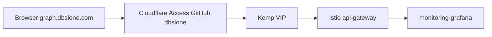

# Grafana at graph.dbslone.com behind Cloudflare Access

Google and GitHub OAuth are both free inside Grafana OSS (SAML is the paid feature). You chose the login you already run: **Cloudflare Access + GitHub**, which is free for up to 50 users and does not need a Google Cloud project or a Grafana OAuth client.

Access is the only login, same as [jobs.dbslone.com](simplefbo-backend-helm/charts/simplefbo-backend/values.yaml). Grafana’s own form stays off so you are not prompted for `admin` / `admin` after GitHub.

## Route

Add a VirtualService in [gateway-helm/charts/simplefbo-api-gateway](gateway-helm/charts/simplefbo-api-gateway), next to the existing telemetry route. Same gateway as Argo, Vault, and jobs: `istio-ingress/api-gateway`. Do not add a second Gateway.

- Host: `graph.dbslone.com`
- Destination: Grafana Service in namespace `monitoring` (kube-prometheus-stack release `monitoring`). Confirm the live name before applying; the chart default is `monitoring-grafana.monitoring.svc.cluster.local` port `80`.
- Gate the template with a `grafanaUi.enabled` flag in [values.yaml](gateway-helm/charts/simplefbo-api-gateway/values.yaml), default on for this host.

## Grafana settings

The monitoring Helm release is not in this repo. Set these on that release (env overrides on the Grafana Deployment are enough; merge them into the real Helm values if you still have that file, because a partial `helm upgrade -f` would reset the rest of the stack):

- `GF_SERVER_ROOT_URL=https://graph.dbslone.com` so redirects and links stay on this host
- `GF_AUTH_ANONYMOUS_ENABLED=true`
- `GF_AUTH_ANONYMOUS_ORG_ROLE=Admin` (solo operator; Viewer would block editing dashboards)
- `GF_AUTH_DISABLE_LOGIN_FORM=true`
- `GF_USERS_ALLOW_SIGN_UP=false`

Record those keys in a short values snippet under `gateway-helm/` so the next monitoring upgrade does not drop them.

Same trust model as the JobRunr dashboard: once Access lets you in, the UI is open. A request that reaches Kemp and skips Cloudflare would also be open. Do not leave the default `admin` / `admin` password in place as a second door.

## Edge (manual, same checklist as vault)

From [vault-helm/CLUSTER.md](vault-helm/CLUSTER.md):

- **Certificate** — `simplefbo-cf-tls` must include `graph.dbslone.com` or `*.dbslone.com`. Reissue the Cloudflare origin cert only if the SAN list is specific hosts and this name is missing.
- **DNS** — proxied CNAME/A for `graph.dbslone.com` to the same target as `jobs.dbslone.com`.
- **Kemp** — add the hostname on the existing public HTTPS virtual service if Kemp matches hostnames.
- **Cloudflare Access** — self-hosted application `https://graph.dbslone.com`. IdP: GitHub. Allow policy Include **GitHub username** `dbslone`, not email (a private GitHub email will not match an email rule).

## Check

- `curl -skI --resolve graph.dbslone.com:443:192.168.7.105 https://graph.dbslone.com` reaches Istio (same style of check as Argo).
- Browser: GitHub login, then Grafana with no second password, and existing SimpleFBO dashboards still load.
